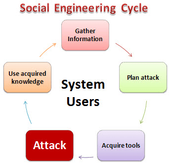

# What is Hacking?

Hacking is the activity of identifying weaknesses in a computer system or a network to exploit the security to gain access to personal data or business data. An example of computer hacking can be: using a password cracking algorithm to gain access to a computer system.

In this hacking tutorial, we will learn-

- Common Hacking Terminologies
- What is Cyber Crime?
- Types of Cyber Crime
- What is Ethical Hacking?
- Why Ethical Hacking?
- Legality of Ethical Hacking
- Summary

Before we learn hacking, let’s look at the introduction of hacking and some of the most commonly used terminologies in the world of hacking.

## Who is a Hacker?

A Hacker is a person who finds and exploits the weakness in computer systems and/or networks to gain access. Hackers are usually skilled computer programmers with knowledge of computer security.

## Types of Hackers

Hackers are classified according to the intent of their actions. The following list classifies types of hackers according to their intent:

### White hat hacker

Ethical Hacker (White hat): A security hacker who gains access to systems with a view to fix the identified weaknesses. They may also perform penetration Testing and vulnerability assessments.

### Black hat hacker

Cracker (Black hat): A hacker who gains unauthorized access to computer systems for personal gain. The intent is usually to steal corporate data, violate privacy rights, transfer funds from bank accounts etc.

### Grey hat hacker

Grey hat: A hacker who is in between ethical and black hat hackers. He/she breaks into computer systems without authority with a view to identify weaknesses and reveal them to the system owner.

### Script kiddies

Script kiddies: A non-skilled person who gains access to computer systems using already made tools.

### Hacktivist

Hacktivist: A hacker who use hacking to send social, religious, and political, etc. messages. This is usually done by hijacking websites and leaving the message on the hijacked website.

### Phreaker

Phreaker: A hacker who identifies and exploits weaknesses in telephones instead of computers.

## Introduction of Cybercrime

Cybercrime is the activity of using computers and networks to perform illegal activities like spreading computer viruses, online bullying, performing unauthorized electronic fund transfers, etc. Most cybercrime hacks are committed through the internet, and some cybercrimes are performed using Mobile phones via SMS and online chatting applications.

### Type of Cybercrime

The following list presents the common types of cybercrimes:

1. **Computer Fraud:** Intentional deception for personal gain via the use of computer systems.
2. **Privacy violation:** Exposing personal information such as email addresses, phone number, account details, etc. on social media, hacking a websites, etc.
3. **Identity Theft:** Stealing personal information from somebody and impersonating that person.
4. **Sharing copyrighted files/information:** This involves distributing copyright protected files such as eBooks and computer programs etc.
5. **Electronic funds transfer:** This involves gaining an un-authorized access to bank computer networks and making illegal fund transfers.
6. **Electronic money laundering:** This involves the use of the computer to launder money.
7. **ATM Fraud:** This involves intercepting ATM card details such as account number and PIN numbers. These details are then used to withdraw funds from the intercepted accounts.
8. **Denial of Service Attacks:** This involves the use of computers in multiple locations to attack servers with a view of shutting them down.

## What is Ethical Hacking?

Ethical Hacking is identifying weakness in computer systems and/or computer networks and coming with countermeasures that protect the weaknesses. Ethical hackers must abide by the following rules.

- Get written permission from the owner of the computer system and/or computer network before hacking.
- Protect the privacy of the organization been hacked.
- Transparently report all the identified weaknesses in the computer system to the organization.
- Inform hardware and software vendors of the identified weaknesses.

## What are Physical Threats?

A physical threat is a potential cause of an incident that may result in loss or physical damage to the computer systems.

The following list classifies the physical threats into three (3) main categories;

- Internal: The threats include fire, unstable power supply, humidity in the rooms housing the hardware, etc.
- External: These threats include Lightning, floods, earthquakes, etc.
- Human: These threats include theft, vandalism of the infrastructure and/or hardware, disruption, accidental or intentional errors.

## Programming languages that are useful to hackers

| COMPUTER LANGUAGES       |                DESCRIPTION                 |       PLATFORM |
| :----------------------- | :----------------------------------------: | -------------: |
| HTML                     |      Language used to write web pages      | Cross platform |
| JavaScript               |       Client side scripting language       | Cross platform |
| PHP                      |       Server side scripting language       | Cross platform |
| MySql                    | Language used to communicate with database | Cross platform |
| Python, Ruby, Bash, Perl |      High level programming languages      | Cross platform |
| C & C++                  |      Low level programming languages       | Cross platform |

## What is Social Engineering?

Social engineering is the art of manipulating users of a computing system into revealing confidential information that can be used to gain unauthorized access to a computer system. The term can also include activities such as exploiting human kindness, greed, and curiosity to gain access to restricted access buildings or getting the users to installing backdoor software.

## How social engineering Works?

HERE,

* Gather Information: This is the first stage, the learns as much as he can about the intended victim. The information is gathered from company websites, other publications and sometimes by talking to the users of the target system.
* Plan Attack: The attackers outline how he/she intends to execute the attack
* Acquire Tools: These include computer programs that an attacker will use when launching the attack.
* Attack: Exploit the weaknesses in the target system.
* Use acquired knowledge: Information gathered during the social engineering tactics such as pet names, birthdates of the organization founders, etc. is used in attacks such as password guessing.